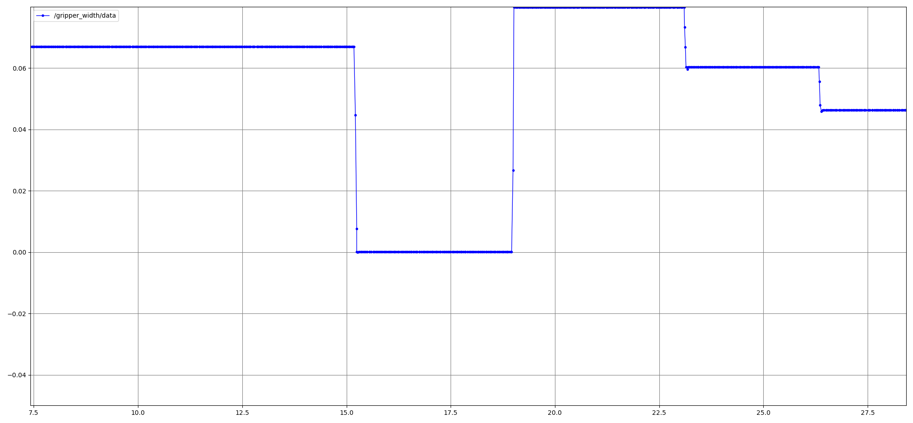
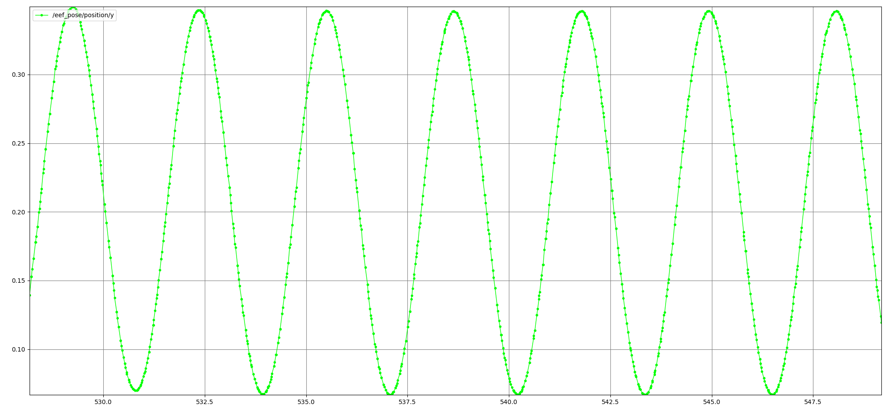
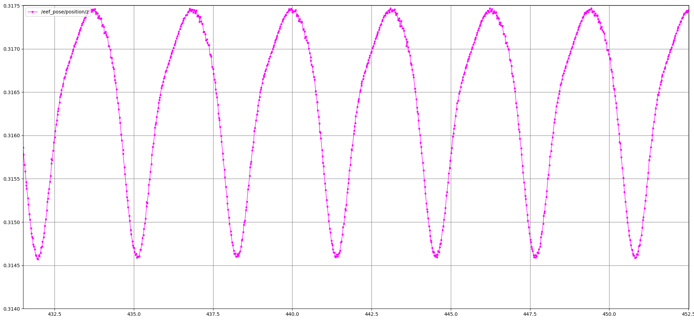

# 基于ROS2 Moveit对O3DE中的机器人进行控制

## 原理

核心的思想是接收用户给定的末端位姿，然后调用moveit提供的API(如逆解和状态管理等)，转换成机器人的关节角度。

此外，由于O3DE中的机械臂只暴露了一个`follow_joint_trajectory`的接口，因此，还需要将实时的关节角度组装成action的消息进行控制。

## 包说明

核心包含三个包

### umi_description

umi相关的模型文件，包含`ur5e`机械臂，二指夹爪以及末端相机的模型。相比于基于ROS1的模型，主要有以下几处核心改动：
1. 修改了夹爪的关节极限，保证夹爪输出的`joint`都是正数，即范围为`[0,0.04m]`，而原始的模型中，夹爪的`joint`可能为负数，后处理容易出错；
2. 修改了原始的`realsense2_descriptin`。原始的文件中，引入`d435`相机对应的`xacro`时，需要指定相对于安装连杆的位姿。但是这个位姿一般无从得知，用户知道的只是相机的光心相对于某一个坐标系的位姿，因此，对原始的`xacro`进行了改动，便于用户使用；

因此，基于改动#1，强烈建议用户使用该ros包中最新的模型进行后续的研究，防止因为ros和O3DE中模型不一致而导致的一些列问题。

### umi_moveit_config

根据`umi_description`中的`umi.xacro`进行配置的moveit包，一般按照官方的教程配置即可。值得注意的是，在配置`arm`相关的group时，需要选择`chain`类型，并保证`tip_link`为`tool_link`(或者其他用户感兴趣的末端)，不然后面运行的结果会不及预期(主要是相对变换可能出错)。

在此基础上，新增了`umi_moveit_config_demo.launch.py`用于启动`moveit`相关的程序。在该文件中，有两处需要特别注意：
1. 由于moveit中，机器人的`joint_states`来自O3DE，因此所有的节点都需要使用`use_sim_time`，参数，且都需要设置为`True`；
2. 在`moveit_config`参数中，需要将`publish_robot_description`和`publish_robot_description_semantic`设置为`True`，否则实例化`move_group`或者`robot_state`的时候可能会失败。

### umi_control

主要分成以下4个节点

#### arm_joint_controller

接收机械臂的关节角度，并转换成action相关的消息格式，进行位置控制。

#### arm_eef_controller

接收末端的位姿(当前是`tool_link`相对于`base`的)，然后调用逆解转换成关节，并进行控制。

#### arm_eef_controller_test

一个测试程序，周期性的发送末端位姿，用来测试机器人是否会运动

#### eef_pose_gripper_width_pub

以一定的频率发送末端位姿和夹爪宽度

## 使用

### 命令行

```
# 确保O3DE中的机器人已经启动
# open terminal 1，打开moveit，注意source相关的工程
ros2 launch umi_moveit_config umi_moveit_config_demo.launch.py

# open terminal 2，打开关节和末端控制器，同时发布末端位姿和夹爪宽度
ros2 launch umi_control arm_eef_servo_controller.launch.py

# open terminal 3，让机械臂末端沿着y轴进行周期性的运动
ros2 launch umi_control arm_eef_servo_controller_test.launch.py
```

### 测试效果

#### 夹爪宽度

监听`gripper_width`，可以获得夹爪宽度，效果如下图。在下图中，随机用rviz中的按钮规划了几组夹爪宽度，可以看到，`gripper_width`很好的监听了宽度



#### 机械臂控制

`arm_eef_controller_test`主要是让末端沿着y方向以正弦曲线的方式运动，运动过程如下


此外，由于O3DE是一个带物理引擎的仿真器，末端控制会有一定的误差，因此在只让y运动的情况下，z和x也会有微小的扰动，比如z的变化如下，最大误差在`3mm`左右，可以满足一般的应用。


## O3DE测需要注意的问题

1. `joint_states`的质量需要选择`Reliable`，不然程序可能会报错；